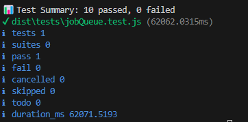

## JobQueue Usage Guide
The `JobQueue` class provides a way to schedule and manage asynchronous jobs with support for concurrency limits, rate limiting, and job timeouts.

## Project structure
```bash
project/
├── dist/             # Compiled JavaScript output
├── node_modules/     # npm dependencies
├── src/              # TypeScript source code
│   ├── classes/
│   ├── types/
│   ├── index.ts      # Main entry point
│   └── test/         # Test files
│       └── index.test.ts # Example test file
├── .gitignore        # Specifies intentionally untracked files that Git should ignore
├── instructions.md   # Your instructions (this file)
├── package-lock.json # Records the exact versions of dependencies
├── package.json      # Project configuration and scripts
├── readme.md         # Project description
└── tsconfig.json     # TypeScript compiler configuration
```
## Instructions to follow along.
- Creating a project structure
- execute:
  - **Initialize your project**
    ```npm
     npm init -y
    ```
  - **Create a index.js file**
    ```npm
      New-Item index.js -type file
    ```
  - **Tells the node to use module ECS**
    ```
        add: "type": "module",
    ```
  - **Added native testing**
    ```
      npm install --save-dev @types/node
      npm install --save-dev ts-node
    ```
  - **To ensure that NODE_OPTIONS="--loader ts-node/esm node ..." is executed, add cross platform support"**
    ```
      npm install --save-dev cross-env
    ```
  - **Test executions**
    ```
      npm test
      npm test:watch
    ```
- **Debug test**
  ```
    npm clean
  ```
## Test image
